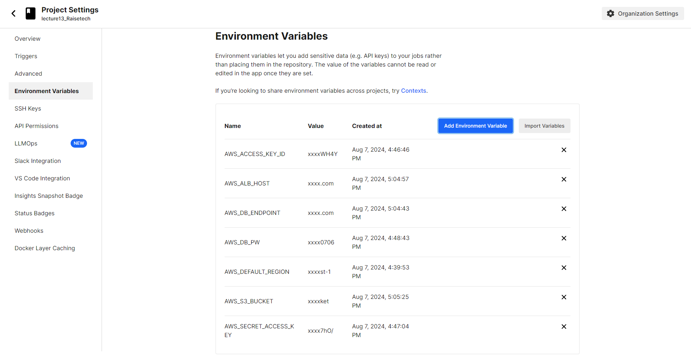
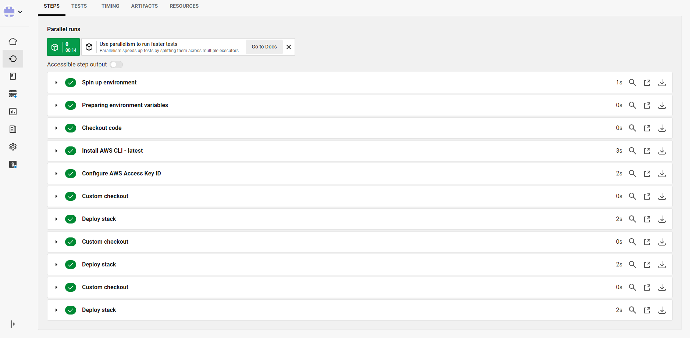
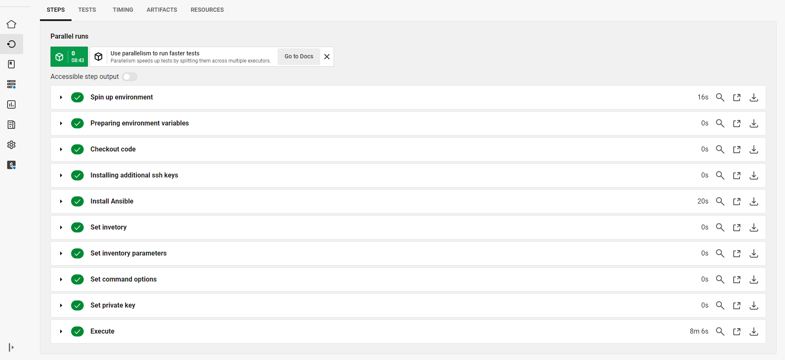
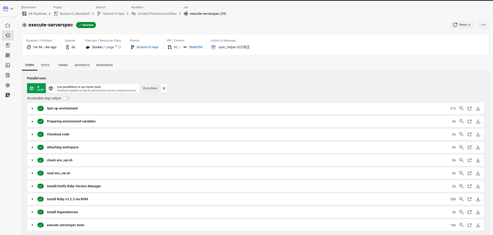
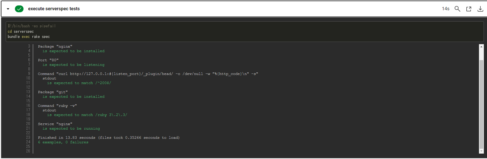
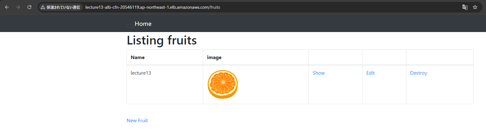

# 第13回課題

## 1. CircleCIのサンプルにServerspecやAnsibleの処理を追加する
### 1.1 CircleCIで環境変数を設定する
- AWS_ACCESS_KEY_ID
- AWS_SECRET_ACCESS_KEY
- AWS_DEFAULT_REGION
- AWS_DB_PW
- AWS_DB_ENDPOINT
- AWS_ALB_HOST
- AWS_S3_BUCKET
 

### 1.2 Cloudformationのスタック作成処理を実行
- 実行結果
 
 
### 1.3 Ansibleの処理を実行
- 実行結果
 
 
### 1.4 serverspecの処理を実行
- 実行結果
 
 
- テスト結果 
 

### 1.5 Railsアプリの動作確認
- ALBのDNS名でアクセスして、正常に動作することを確認
 
